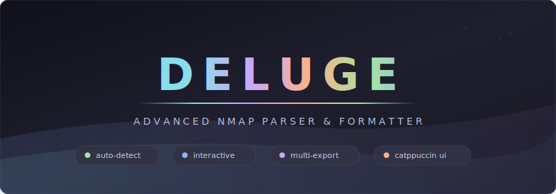

<div align="center">



[](LICENSE)
[](https://www.python.org/downloads/)
[](https://nmap.org/)

<br>

Deluge is a parser and formatter for Nmap and RustScan outputs — it transforms raw scan data into color-coded terminal reports and multi-format exports. It does not execute scans itself. The primary workflow is `rustscan | deluge -sV` where interactive mode auto-enables when stdin carries Nmap arguments.

</div>

<br>

## Table of Contents

- [Highlights](#highlights)
- [Quick Start](#quick-start)
- [Usage](#usage)
- [Command Reference](#command-reference)
- [Architecture](#architecture)
- [Tech Stack](#tech-stack)
- [Features](#features)
- [Export Formats](#export-formats)
- [Development](#development)
- [Troubleshooting](#troubleshooting)
- [Contributing](#contributing)

---

## Highlights

<table>
<tr>
<td width="50%">

### Interactive Mode
Pipe RustScan output in with Nmap flags and Deluge automatically enters interactive mode — spawning targeted Nmap scans per discovered port with live progress bars. No `--interactive` flag needed.

</td>
<td width="50%">

### Intelligent Parsing
Auto-detects Nmap XML, Nmap stdout, and RustScan output formats via a factory-pattern parser registry. Hand it any supported format and it figures out the rest.

</td>
</tr>
<tr>
<td width="50%">

### Multi-Format Export
Generate JSON, CSV, HTML, XML, and TXT reports from a single scan. Exports land in timestamped subdirectories. Use `--export-format all` to get everything at once.

</td>
<td width="50%">

### Catppuccin Terminal UI
Rich-powered tables, panels, and progress bars styled with the Catppuccin Mocha palette. Color-coded ports, services, OS detection, script results, and traceroute hops.

</td>
</tr>
<tr>
<td width="50%">

### Safety Checks
Prerequisite detection for Nmap with OS-specific install instructions, privilege warnings for scans requiring root, input validation on Nmap flags, and Rich-formatted error messages instead of stack traces.

</td>
<td width="50%">

### Concurrent Scanning
Interactive mode runs configurable worker threads that execute targeted Nmap scans in parallel. Results merge into a unified model under a thread lock for safe concurrent access.

</td>
</tr>
<tr>
<td width="50%">

### HackTricks Integration
For every open service discovered, Deluge automatically provides a direct link to the relevant HackTricks enumeration guide — covering 40+ services from FTP and SSH to Redis and MongoDB.

</td>
<td width="50%">

### Domain & Identity Extraction
Automatically extracts and displays domain names, SSL certificate CNs/SANs, NetBIOS names, and AD forest information from host scripts and service data.

</td>
</tr>
</table>

---

## Quick Start

### Prerequisites

| Requirement | Version | Notes |
|-------------|---------|-------|
| Python | >= 3.8 | Required |
| Nmap | >= 7.90 | Required for interactive mode |
| RustScan | Latest | Optional, recommended for fast discovery |

### Install

```bash
# pipx (recommended — isolated environment, global command)
pipx install git+https://github.com/Real-Fruit-Snacks/Deluge.git

# Or standard pip
pip install git+https://github.com/Real-Fruit-Snacks/Deluge.git
```

### First Scan

```bash
# Interactive mode (auto-detected from -sV flag)
rustscan -a 192.168.1.0/24 --ulimit 5000 | deluge -sV

# Parse an existing Nmap XML file
deluge --file scan.xml

# Pipe Nmap XML directly
nmap -sV 192.168.1.1 -oX - | deluge
```

> Interactive mode is automatic — Deluge detects Nmap arguments on stdin and switches modes without any flag. Use `--file -` to force simple parsing when you want to override this.

---

## Usage

### Interactive Mode (RustScan Workflow)

```bash
# Service detection with exports
rustscan -a targets.txt --ulimit 5000 | deluge -sV --export-format json html csv

# Aggressive scan with timing and threads
rustscan -a 10.0.0.1 --ulimit 5000 | deluge -A -T4 --threads 10

# All export formats to a custom directory
rustscan -a 192.168.1.0/24 | deluge -sV --export-format all --export-dir ~/reports
```

### File Parsing

```bash
# Single file
deluge --file scan.xml

# Batch convert XML to JSON
for file in scans/*.xml; do
    deluge --file "$file" --export-format json --export-dir ./converted/
done
```

### Stdin Parsing

```bash
# Nmap XML via pipe (simple parsing, no interactive mode)
nmap -sV 192.168.1.1 -oX - | deluge

# Force simple parsing even with Nmap args present
nmap -sV target -oX - | deluge --file -
```

---

## Command Reference

| Flag | Description | Default |
|------|-------------|---------|
| `--file <path>` | Parse existing scan file. Use `--file -` for forced stdin parsing | — |
| `--interactive` | Explicitly enable interactive mode (usually auto-detected) | Auto |
| `--threads <N>` | Concurrent Nmap worker threads in interactive mode | `3` |
| `--export-format <fmt>` | Space-separated: `json csv html xml txt all` | — |
| `--export-dir <path>` | Export directory (creates timestamped subdirectory) | `./deluge_exports` |
| `--verbose`, `-v` | Enable debug logging | `false` |
| `--no-check` | Skip prerequisite and permission checks | `false` |
| `[nmap_args]` | Any valid Nmap flags (e.g., `-A`, `-sV`, `-T4`) — triggers interactive mode | — |

### Mode Detection

| Condition | Mode |
|-----------|------|
| Stdin + Nmap args | Interactive (auto) |
| Stdin + no args | Simple parsing |
| `--file <path>` | File parsing |
| `--file -` | Forced simple stdin parsing |

---

## Architecture

Deluge follows a three-layer architecture with a unidirectional data flow: input is parsed into a Pydantic model, then rendered to terminal or exported to files.

```
deluge/
├── core/                    # Business logic
│   ├── engine.py           # Scan orchestration, interactive mode, threading
│   ├── export.py           # Multi-format export manager (thread-safe)
│   ├── models.py           # Pydantic v2 data models (ScanResult → HostInfo → PortInfo)
│   ├── utils.py            # Prerequisite checks, privilege detection, validation
│   └── logger.py           # Logging configuration
├── parsers/                # Parser suite (Factory pattern)
│   ├── base.py            # Abstract base parser (ABC)
│   ├── nmap_xml.py        # Nmap XML parser (priority 1)
│   ├── nmap_stdout.py     # Nmap stdout parser (priority 2)
│   ├── rustscan.py        # RustScan output parser (priority 3)
│   └── __init__.py        # ParserFactory registry, @register decorator
└── interface/              # Presentation layer
    ├── cli.py             # Argument handling, mode detection
    └── formatter.py       # Rich UI — tables, panels, progress bars
```

### Data Flow

```
Input (stdin / file)  →  ParserFactory.get_parser()  →  ScanResult model
                                                            ↓
                                              NmapFormatter (terminal display)
                                              ExportManager (JSON/CSV/HTML/XML/TXT)
```

### Parser Registry

Parsers self-register via `@ParserFactory.register` at import time. Registration order determines detection priority — `nmap_xml` is tried first, then `nmap_stdout`, then `rustscan`. The first parser whose `can_parse()` returns `True` wins.

---

## Tech Stack

| Layer | Technology |
|-------|------------|
| **Language** | Python 3.8+ with `from __future__ import annotations` |
| **Data models** | Pydantic v2 (`BaseModel`, `model_dump`) |
| **Terminal UI** | Rich (tables, panels, progress bars, Live display) |
| **XML parsing** | lxml |
| **Theming** | Catppuccin Mocha (hex color constants) |
| **Linting** | ruff (default config) |
| **Testing** | pytest |

No framework. No build step. Just a pip-installable CLI.

---

## Features

| Feature | Description |
|---------|-------------|
| **Interactive mode** | RustScan pipe → auto-detect → concurrent Nmap scans → merged results |
| **Auto-detection** | Format and mode determined automatically from input |
| **Multi-format export** | JSON, CSV, HTML, XML, TXT — one command, multiple outputs |
| **Live progress** | Real-time spinners and progress bars via `rich.live.Live` |
| **Color-coded output** | Ports, services, states, and OS info styled by category |
| **OS detection** | Parsed and displayed with match accuracy percentages |
| **Script results** | NSE script output parsed and formatted per port |
| **Traceroute** | Hop-by-hop display with RTT and hostnames |
| **Service metadata** | Product, version, extra info, CPE, and service fingerprints |
| **Concurrent workers** | Configurable thread pool for interactive mode scanning |
| **Prerequisite checks** | Nmap detection with OS-specific install instructions |
| **Privilege detection** | Warns when scan flags require root/sudo |
| **Input validation** | Nmap flag validation before execution |
| **TTY detection** | Clean output when piped (no formatting artifacts) |
| **Timestamped exports** | `scan_YYYYMMDD_HHMMSS/` subdirectories prevent overwrites |
| **Per-port XML export** | Interactive mode saves individual Nmap XML per IP/port |
| **HackTricks links** | Automatic enumeration guide URLs for 40+ services (port and service-name matching with deduplication) |

---

## Export Formats

All formats generated from the same `ScanResult` model:

| Format | File | Description |
|--------|------|-------------|
| **JSON** | `scan.json` | Full structured data — hosts, ports, services, scripts, OS |
| **CSV** | `scan.csv` | Tabular — IP, port, protocol, state, service, version |
| **HTML** | `scan.html` | Styled web report for sharing and printing |
| **XML** | `scan.xml` | Nmap-compatible XML for tool interoperability |
| **TXT** | `summary.txt` | Human-readable summary for quick review |

```
deluge_exports/
└── scan_20260205_213245/
    ├── scan.json
    ├── scan.csv
    ├── scan.html
    ├── scan.xml
    └── summary.txt
```

---

## Development

### Adding a New Parser

1. Create `deluge/parsers/your_parser.py`
2. Subclass `BaseParser`, implement `name`, `can_parse()`, `parse()`
3. Decorate with `@ParserFactory.register`
4. Import the module in `deluge/parsers/__init__.py` (order = priority)

### Adding a New Export Format

1. Add `export_yourformat()` to `ExportManager` in `core/export.py`
2. Register in the `format_map` dict inside `export_all()`
3. Add the format name to `--export-format` choices in `cli.py`

### Testing

```bash
pytest                        # All tests
pytest --cov=deluge           # With coverage
pytest tests/test_banner.py   # Single file
ruff check .                  # Lint (matches CI)
```

CI runs `ruff check .` and `pytest` across Python 3.8–3.12.

---

## Troubleshooting

| Problem | Solution |
|---------|----------|
| `Nmap binary not found` | Install Nmap: `apt install nmap` / `brew install nmap` / [nmap.org](https://nmap.org/download.html) |
| `Requires root privileges` | Run with `sudo`: `sudo rustscan -a target \| sudo deluge -A` |
| `No input source provided` | Deluge needs piped input or `--file`: `rustscan -a target \| deluge -sV` |
| No output / incomplete parse | Ensure Nmap XML format (`-oX -`), try `--verbose` for debug logging |
| Export permission error | Use `--export-dir ~/scans` or fix directory permissions |

---

## Contributing

1. Fork the repository
2. Create a feature branch (`git checkout -b feature/my-feature`)
3. Make your changes
4. Run `ruff check . && pytest` — both must pass
5. Commit with a descriptive message
6. Open a Pull Request

See [CONTRIBUTING.md](CONTRIBUTING.md) for detailed guidelines.

---

<div align="center">

**Parser, not a wrapper. Pipe in scans, get beautiful output.**

[GitHub](https://github.com/Real-Fruit-Snacks/Deluge) | [License (MIT)](LICENSE) | [Report Issue](https://github.com/Real-Fruit-Snacks/Deluge/issues)

</div>
